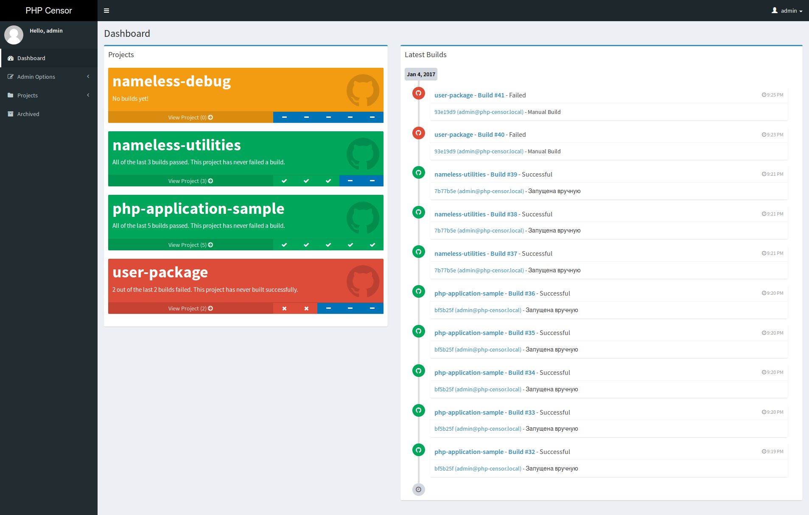

[](http://ci.php-censor.info/build-status/view/2?branch=master)
[](https://travis-ci.org/php-censor/php-censor?branch=master)
[](https://insight.sensiolabs.com/projects/26f28bee-a861-45b2-bc18-ed2ac7defd22)
[](https://codecov.io/gh/php-censor/php-censor)
[](https://packagist.org/packages/php-censor/php-censor)
[](https://packagist.org/packages/php-censor/php-censor)
[](https://packagist.org/packages/php-censor/php-censor)
   
   
<p align="center">
    
</p>
   
   
**PHP Censor** is a open source self-hosted continuous integration server for PHP projects 
([PHPCI](https://www.phptesting.org) fork).

**Twitter**: [@php_censor](https://twitter.com/php_censor).

[](docs/screenshots/dashboard.png)

More [screenshots](docs/en/screenshots.md).

* [System requirements](#system-requirements)
* [Features](#features)
* [Installing](#installing)
* [Installing via Docker](#installing-via-docker)
* [Updating](#updating)
* [Configuring project](#configuring-project)
* [Migrations](#migrations)
* [Tests](#tests)
* [Documentation](#documentation)
* [License](#license)

## System requirements

* Unix-like OS (**Windows isn't supported**);

* PHP 5.6+ (with OpenSSL support and enabled functions: `exec()`, `shell_exec()` and `proc_open()`);

* Web-server (Nginx or Apache2);

* Database (MySQL/MariaDB or PostgreSQL);

* Beanstalkd queue (Optional, needed if you use [worker](docs/en/workers/worker.md) instead of 
[cronjob](docs/en/workers/cron.md));

## Features

* Clone project from [GitHub](docs/en/sources/github.md), [Bitbucket](docs/en/sources/bitbucket.md) (Git/Hg), 
[GitLab](docs/en/sources/gitlab.md), [Git](docs/en/sources/git.md), Hg (Mercurial), SVN (Subversion) or from local 
directory;

* Set up and tear down database tests for [PostgreSQL](docs/en/plugins/pgsql.md), [MySQL](docs/en/plugins/mysql.md) or 
[SQLite](docs/en/plugins/sqlite.md);

* Install [Composer](docs/en/plugins/composer.md) dependencies;

* Run tests for PHPUnit, Atoum, Behat, Codeception and PHPSpec;

* Check code via Lint, PHPParallelLint, Pdepend, PHPCodeSniffer, PHPCpd, PHPCsFixer, PHPDocblockChecker, PHPLoc, 
PHPMessDetector, PHPTalLint and TechnicalDept;

* Run through any combination of the other [supported plugins](docs/en/README.md#plugins), including Campfire, 
CleanBuild, CopyBuild, Deployer, Env, Git, Grunt, Gulp, PackageBuild, Phar, Phing, Shell and Wipe;

* Send notifications on Email, XMPP, Slack, IRC, Flowdock, HipChat and 
[Telegram](https://github.com/LEXASOFT/PHP-Censor-Telegram-Plugin);

* Use your LDAP-server for authentication;

## Installing

* Go to the directory in which you want to install PHP Censor, for example: `/var/www`:

```bash
cd /var/www
```

* Create project by Composer:

```bash
composer create-project php-censor/php-censor php-censor.local --keep-vcs
```

Or download [latest archive](https://github.com/php-censor/php-censor/releases/latest) from GitHub, unzip it and run 
`composer install`.

* Create empty database for application (MySQL/MariaDB or PostgreSQL);

* Install Beanstalkd Queue (Optional, if you are going to use queue with Worker):

```bash
aptitude install beanstalkd # For deb-based
```

* Install PHP Censor itself:

```bash
cd ./php-censor.local

# Interactive installation
./bin/console php-censor:install

# Non-interactive installation
./bin/console php-censor:install --url='http://php-censor.local' --db-type=pgsql --db-host=localhost --db-name=php-censor --db-user=php-censor --db-password=php-censor --db-port=null --admin-name=admin --admin-password=admin --admin-email='admin@php-censor.local' --queue-use=1 --queue-host=localhost --queue-name=php-censor

# Non-interactive installation with prepared config.yml file
./bin/console php-censor:install --config-from-file=yes --admin-name=admin --admin-password=admin --admin-email='admin@php-censor.local'
```

* [Add a virtual host to your web server](docs/en/virtual_host.md), pointing to the `public` directory within your new
PHP Censor directory. You'll need to set up rewrite rules to point all non-existent requests to PHP Censor;

* [Set up the PHP Censor Worker](docs/en/workers/worker.md) (Need configured Queue) or 
[a cron-job](docs/en/workers/cron.md) to run PHP Censor builds;

## Installing via Docker

If you want to install PHP Censor as Docker container, you can use 
[php-censor/docker-php-censor](https://github.com/php-censor/docker-php-censor) project.

## Updating

* Go to your PHP Censor directory (to `/var/www/php-censor.local` for example):

    ```bash
    cd /var/www/php-censor.local
    ```

* Pull the latest code from repository by Git (If you want latest `master` branch):

    ```bash
    git checkout master
    git pull -r
    ```

    Or pull latest version:

    ```bash
    git fetch
    git checkout <version>
    ```

* Update the Composer dependencies: `composer install`

* Update the database scheme:

    ```bash
    ./bin/console php-censor-migrations:migrate
    ```

* Restart Supervisord workers (If you use workers and Supervisord):

    ```bash
    sudo supervisorctl status
    sudo supervisorctl restart <worker:worker_00>
    ...
    sudo supervisorctl restart <worker:worker_nn>
    ```
    
    Or restart Systemd workers (If you use workers and Systemd):
    
    ```bash
    sudo systemctl restart <worker@1.service>
    ...
    sudo systemctl restart <worker@n.service>
    ```

## Configuring project

There are several ways to set up the project:

* Add project without any project config (Runs "zero-config" plugins, including: Composer, TechnicalDept, PHPLoc, 
PHPCpd, PHPCodeSniffer, PHPMessDetector, PHPDocblockChecker, PHPParallelLint, PHPUnit and Codeception);

* Similar to [Travis CI](https://travis-ci.org), to support PHP Censor in your project, you simply need to add a 
`.php-censor.yml` (`phpci.yml`/`.phpci.yml` for backward compatibility with PHPCI) file to the root of your repository;

* Add project config in PHP Censor project page (And it will cancel file config from project repository);

The project config should look something like this:

```yml
setup:
  composer:
    action: "install"
test:
  php_unit:
    config: "phpunit.xml"
  php_mess_detector:
    allow_failures: true
  php_code_sniffer:
    standard: "PSR2"
  php_cpd:
    allow_failures: true
complete:
  email:
    default_mailto_address: admin@php-censor.local
```

More details about [configuring project](docs/en/configuring_project.md).

## Migrations

Run to apply latest migrations:

```bash
cd /path/to/php-censor
./bin/console php-censor-migrations:migrate
```

Run to create new migration:

```bash
cd /path/to/php-censor
./bin/console php-censor-migrations:create NewMigrationName
```

## Tests

```bash
cd /path/to/php-censor

./vendor/bin/phpunit --configuration ./phpunit.xml --coverage-html ./tests/runtime/coverage -vvv --colors=always
```

For Phar plugin tests set 'phar.readonly' setting to Off (0) in `php.ini` config. Otherwise tests will be skipped.  

For database B8Framework tests create empty 'b8_test' database on 'localhost' with user/password: `root/<empty>` 
for MySQL and with user/password: `postgres/<empty>` for PostgreSQL (You can change default test user, password and 
database name in `phpunit.xml` config constants). If connection failed tests will be skipped.

## Documentation

[Full PHP Censor documentation](docs/en/README.md).

## License

PHP Censor is open source software licensed under the [BSD-2-Clause license](LICENSE).
