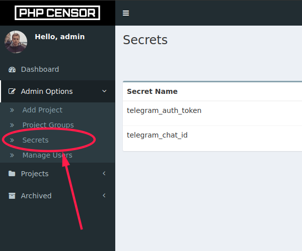

Injecting variables into messages
=================================

Precompiled variables
---------------------

Most strings used in the build configuration can have variables related to the build inserted into them with the 
following syntax:

```
"My important message is about %VARIABLE%"
```

Where `VARIABLE` can be one of the following:

* **COMMIT_ID** - The commit hash.
* **SHORT_COMMIT_ID** - The shortened version of the commit hash.
* **COMMITTER_EMAIL** - The Email address of the committer.
* **COMMIT_MESSAGE** - The message written by the committer.
* **COMMIT_LINK** - The URL to the commit.
* **BRANCH** - The name of the branch.
* **BRANCH_LINK** - The URL to the branch.
* **ENVIRONMENT** - Build environment (See [environments](environments.md)).
* **SYSTEM_VERSION** - Version of PHP Censor application.
* **PROJECT_ID** - The ID of the project.
* **BUILD_ID** - The build number.
* **PROJECT_TITLE** - The name of the project.
* **PROJECT_LINK** - The URL to the project in PHP Censor.
* **BUILD_PATH** - The path to the build.
* **BUILD_LINK** - The URL to the build in PHP Censor.


* **CURRENT_DATE** - Current date in format "Y-m-d".
* **CURRENT_TIME** - Current time in format "H-i-s".
* **CURRENT_DATETIME** - Current date and time in format "Y-m-d_H-i-s".

Secret variables
----------------



Also, you can create secret variable in admin interface (Open "Admin Options" -> "Secrets" section in admin interface: 
`://php-censor.local/secret`) and use it as variable in build configuration like:

```
"My important message is about %SECRET:secret-name%"
```
